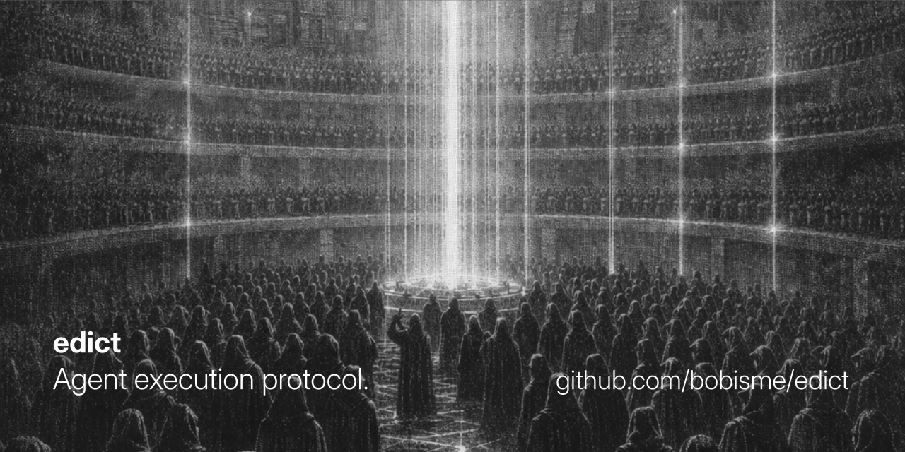
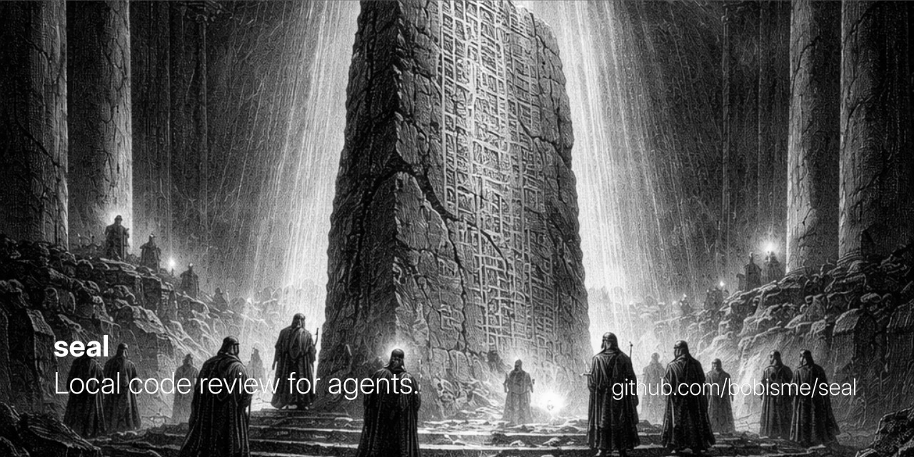
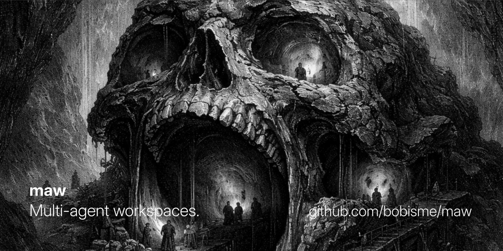
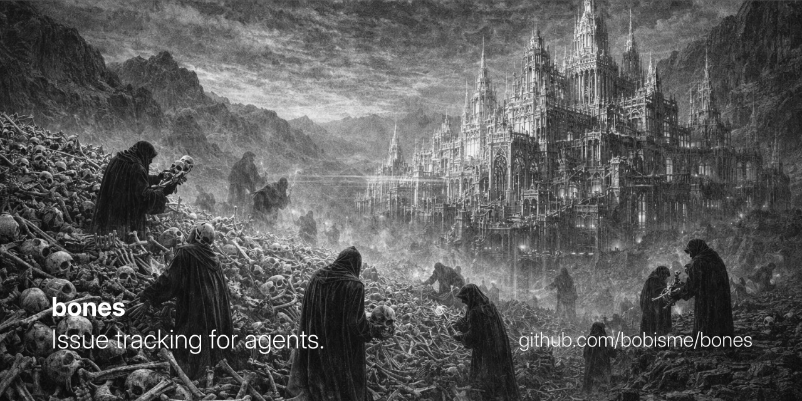
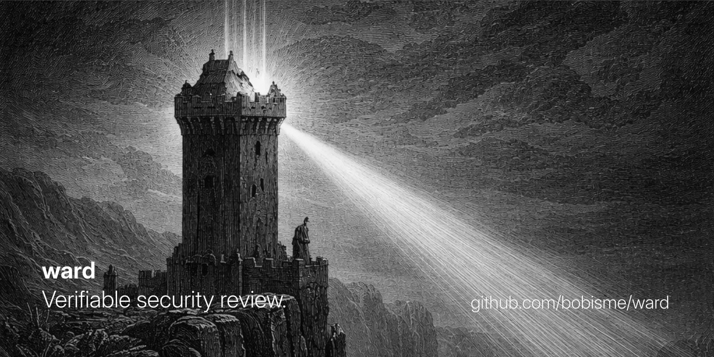
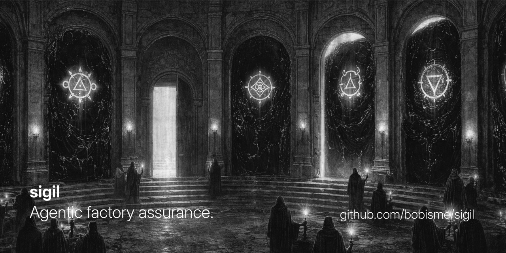
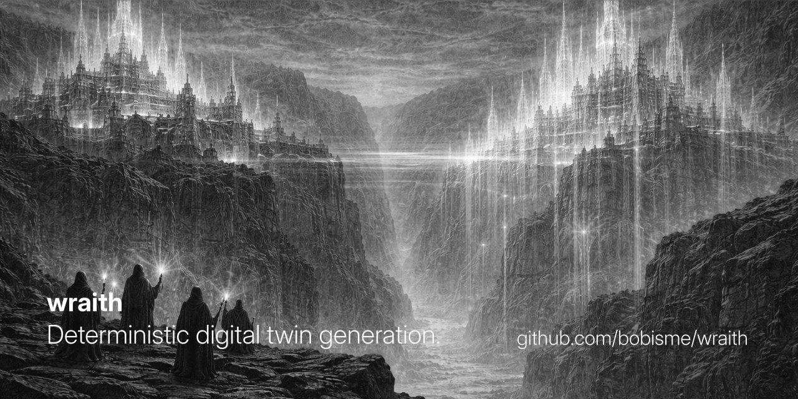

# Bob

**Security Engineer** · **AI Engineering Enthusiast**

_Building tools for the next chapter of software engineering._

## The Reliquary

**Apocalyptic-scale coordination for machine and human collaborators.**

These projects are meant to work together. Some handle how agents communicate, some manage execution and workspace isolation, some review or judge changes, and some make backlog, security, or system behavior legible enough for autonomous work to stay grounded in reality.

<table>
  <tr>
    <td width="300" valign="top">
      
    </td>
    <td valign="top">
      <a href="https://github.com/bobisme/edict"><strong>edict</strong></a> 
      The orchestration layer for multi-agent workflows. It bootstraps projects, syncs workflow docs and companion tool config, validates setup, and runs the dev, worker, and reviewer loops that turn the rest of the toolchain into a coherent system.
    </td>
  </tr>
  <tr>
    <td width="300" valign="top">
      
    </td>
    <td valign="top">
      <a href="https://github.com/bobisme/rite"><strong>rite</strong></a> 
      Chat-oriented coordination for AI coding agents. It gives agents messaging, presence, subscriptions, hooks, and advisory claims over files or arbitrary resources so they can announce intent, avoid collisions, and coordinate across repos without a central service.
    </td>
  </tr>
  <tr>
    <td width="300" valign="top">
      
    </td>
    <td valign="top">
      <a href="https://github.com/bobisme/vessel"><strong>vessel</strong></a> 
      A PTY-based runtime for spawning, steering, and observing terminal-native agents. It is meant for orchestrators and test harnesses that need real terminal semantics, snapshots, wait conditions, and reliable control over interactive agent sessions.
    </td>
  </tr>
  <tr>
    <td width="300" valign="top">
      
    </td>
    <td valign="top">
      <a href="https://github.com/bobisme/seal"><strong>seal</strong></a> 
      Distributed code review built for teams of agents and humans working locally. It keeps review with the repository itself so comments, blocks, and approvals can happen asynchronously without depending on a hosted PR system.
    </td>
  </tr>
  <tr>
    <td width="300" valign="top">
      
    </td>
    <td valign="top">
      <a href="https://github.com/bobisme/maw"><strong>maw</strong></a> 
      Multi-agent workspaces with deterministic merge behavior and recovery-aware lifecycle controls. It gives each agent an isolated workspace, keeps parallel work manageable, and makes merge outcomes and recovery paths much more predictable than raw worktrees alone.
    </td>
  </tr>
  <tr>
    <td width="300" valign="top">
      
    </td>
    <td valign="top">
      <a href="https://github.com/bobisme/bones"><strong>bones</strong></a> 
      A CRDT-native issue tracker for distributed human and agent collaboration. It uses an append-only event log and rebuildable projections so backlog state converges cleanly, machine-readable workflows stay first-class, and tracker edits stop turning into normal merge pain.
    </td>
  </tr>
  <tr>
    <td width="300" valign="top">
      
    </td>
    <td valign="top">
      <strong>ward</strong> - currently under closed development, releasing soon. 
      Verifiable security review with deterministic evidence, calibrated risk, and signed provenance. This is the security layer in the stack: the goal is not just to flag issues, but to make security judgments inspectable, replayable, and trustworthy enough for autonomous workflows.
    </td>
  </tr>
  <tr>
    <td width="300" valign="top">
      
    </td>
    <td valign="top">
      <strong>sigil</strong> - currently under closed development, releasing soon. 
      An autonomous merge policy engine for agent-written pull requests. It evaluates changes against holdout scenarios the coding agent never saw, then compares baseline vs. candidate behavior to answer the question that matters most: did this change actually make the system better or worse?
    </td>
  </tr>
  <tr>
    <td width="300" valign="top">
      
    </td>
    <td valign="top">
      <strong>wraith</strong> - currently under closed development, releasing soon. 
      An API digital twin platform that records real systems, serves deterministic local twins, and detects drift over time. The aim is to let agents and developers build against realistic behavior locally without depending on live services or hand-maintained mocks.
    </td>
  </tr>
</table>

## Hand-written code

_Yes, I know how to code._

- [Advent of Code Solutions](https://github.com/bobisme/aoc)
- [Synacor Challenge](https://github.com/bobisme/vm-challenge)
